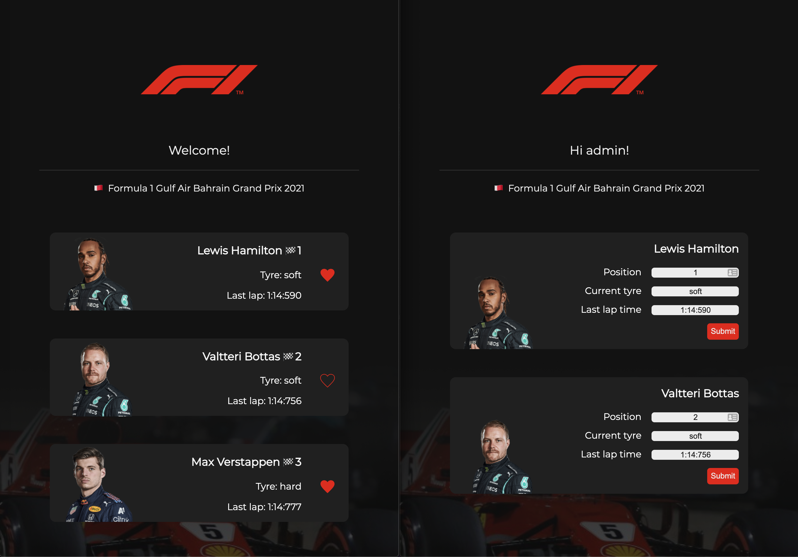
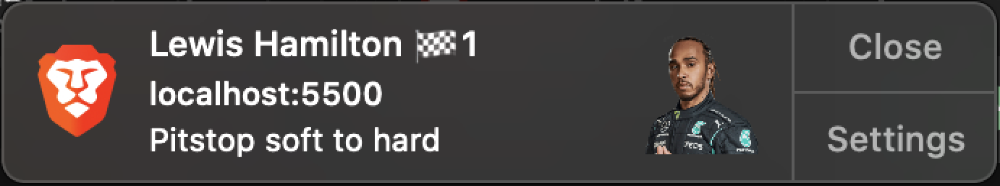
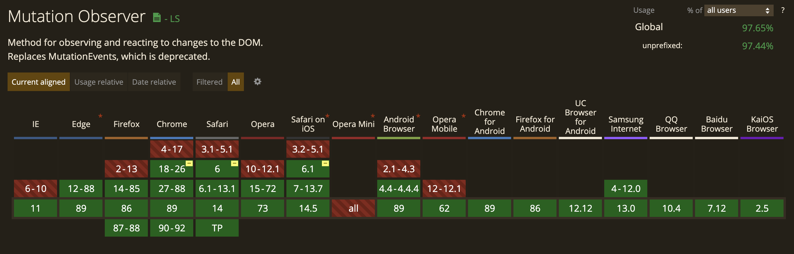
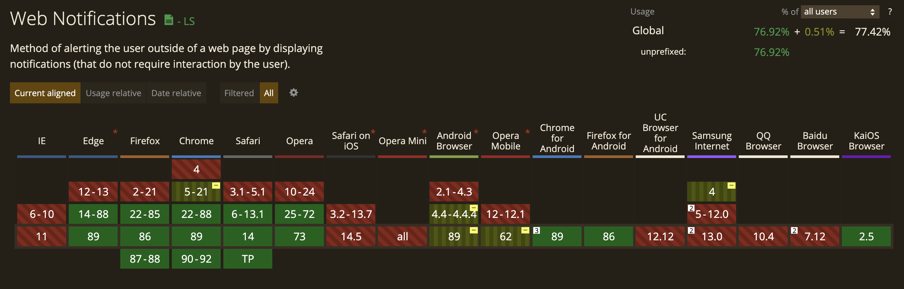
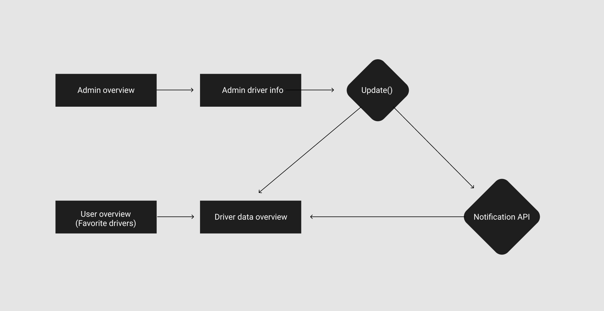
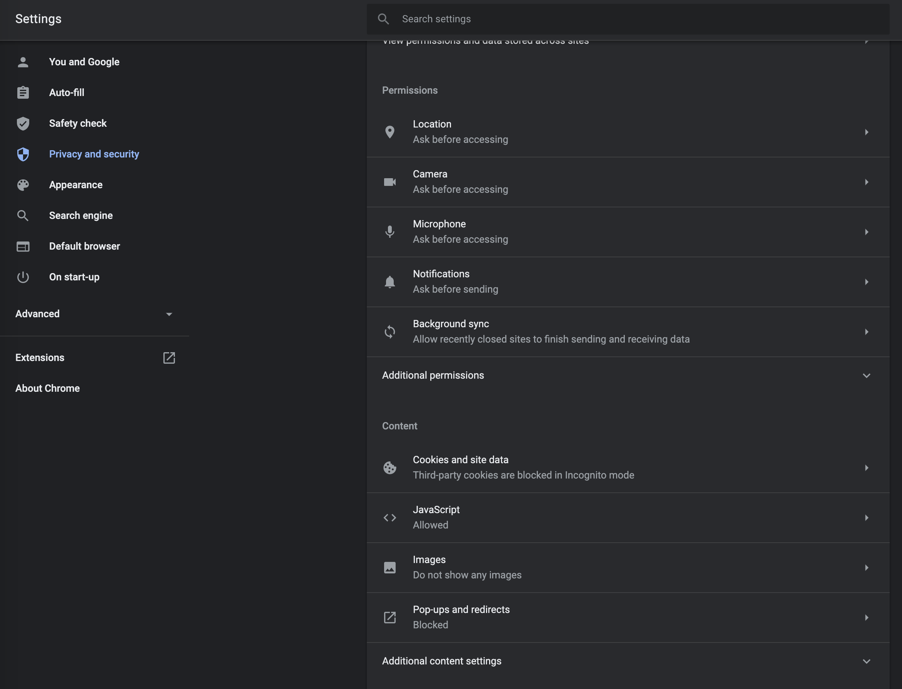
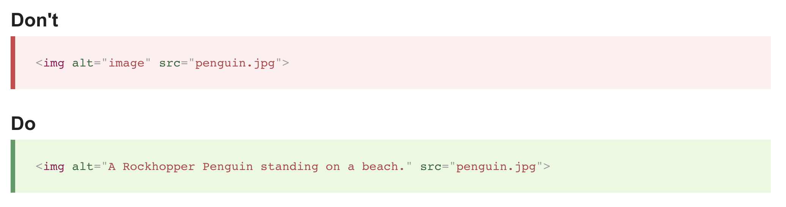

# F1 live data webapp
This webapp is an experimental app build using node, express and ejs to display formula 1 driver data during a race. The data can be changed from an admin page and the result on an overview page. When data is changed on the admin page it will dynamically change on the other page.

Try the app out yourself [here!](https://expressjs.com/)

Not all pages have a button to get there (oops), the pages you can visit are:

- "/": the main overview page, this is the page you will start out at.
- "/admin": the admin page, you can alter data here.
- "/mydrivers": here you will see data only from the drivers that are liked. This page also has notifications.

So, for example, go to https://f1-live-data.herokuapp.com/mydrivers to see the mydrivers page.

<br>

## Instructions (install local)

- Download or clone the repository
- Navigate to the right folder in the terminal using cd
- Install using: npm install
- Start a server with npm start

<br>
<br>

# Packages
npm packages used in this project

- Express [Link](https://expressjs.com/)
- EJS [link](https://ejs.co/)
- dotenv, to protect my database information on github [link](https://www.npmjs.com/package/dotenv)
- AOS, scrolling animation library [link](https://michalsnik.github.io/aos/)
- Mongodb [link](https://www.npmjs.com/package/mongodb)

## Dev dependencies

- nodemon [link](https://www.npmjs.com/package/nodemon)

<br>
<br>

# The app



You can see a list of all the f1 drivers (example on the left) and can see their live data from the race. You can also follow specific drivers, doing this will then show only these drivers on the /mydrivers page.

On the /admin page (example on the right) you can change driver data and send this information to the server using the submit button. The data will dynamically change on the overview page using ajax. If you have the mydrivers page open and data is changed from one of the liked drivers, you will get a notification. The browser will first ask for persmission.

<br>



<br>

(Unfortunately, Heroku has some problems with my ajax fetch. So data currently is not updated async. I am trying to figure out what is causing the problem. If you want to test the notification install the app locally.)

<br>
<br>

# Progressive enhancements

I mainly focused on the javascript for this project. I feel like not having acces to javascript is one of the biggest handicaps a developer could have, so i wanted to challenge myself and make the apps core functions available for users without javascript.

The first main feature that works with javascript is the like button, the heart next to the drivers. This button does a couple of things:
- it changes the data in the database from "follow: no" to "follow: yes". This way i can see which drivers are currently liked.
- It changes the appearance of the heart svg from only outline to filled. This way the user can see which drivers are currently being followed.
- It adds a css class that animates the heart, making it look like the heart beats for a second.

Here is (some of) the code that changes these things
``` js
if(votetype === "no"){
        this.querySelector('input[name="votetype"]').value = "yes";
        svg.style.stroke ="#EE0000";
        svg.style.fill ="none";
        svg.classList.remove("svg-filled");
      }else if(votetype === "yes"){
        this.querySelector('input[name="votetype"]').value = "no";
        svg.style.stroke ="none";
        svg.style.fill ="#EE0000";
        svg.classList.add("svg-filled");
      }

      event.preventDefault();
```

At the end of this block of code i use preventDefeault. This functionality also works without javascript, i build this like functionality twice. Once in HTML with submit forms and the server, and once with javascript. If javascript is available, the preventDefault makes it so the HTML version of this functionality is skipped, and the more enhanced javascript version takes its place. If javascript is not available, the HTML version can do the same thing. Even though not as nice because the HTML version uses a complete page reload to show the changes. 

See the index.ejs file for more info on how i did this.

## Notification web api

First i check if notifications are supported in the current browser.

```js
if (("Notification" in window)) {
```

Then i use a webapi called mutationobserver to wait for changes in certain html elements. When a change is recorded i can then fire a function that in this case shows a notification. This is what the setup for the mutationobserver looks like:
(var positionObserver is in this case an html element i want to monitor)

``` js
var positionObserver = new MutationObserver(function(mutations) {
    mutations.forEach(function(mutation) {
```

The notification api will activate a function if it has acces from the user. If it does not have acces, users will get a prompt asking for permission and then it will try to activate the function again.

``` js
if (Notification.permission === "granted") {
        tyreNotification()
      }

      else if (Notification.permission === "default") {
      Notification.requestPermission().then(function (permission) {
        if (permission === "granted") {
          tyreNotification()
        }
```

<br>

Find more information about the mutation observer webapi and notification webapi here:
- [MutationObserver link](https://developer.mozilla.org/nl/docs/Web/API/MutationObserver)

- [Notifications link](https://developer.mozilla.org/en-US/docs/Web/API/Notification)


<br>

## The database

I used a MongoDB database to store my information


Every driver has a name (obviously) and race data. The follow indicates which heart needs to be filled and which drivers need to be shown on the /mydrivers page.

## Wireflow



<br>

# browsers
- Brave
- Safari desktop
- ios Safari
- Chrome mobile

<br>
<br>
<br>

# EXTRA, Break the Web
For this excersize i will research 2 web features to see what happens when you disable them. The two features are:
1. Images
2. Mouse/trackpad

## Images
Images are an important part of most websites, they allow us to add visual context to any content. But what if someone disables images in their browser?
<br />
<br />

<!--  -->

### WHY?!
Why would someone disable images on the internet to begin with? People could be blocking images for different reasons, for example:
* People with visual impairments use non-visual browsers, these browsers use screen readers to read the content aloud. Images are useless in this context and are not displayed.
* Some people choose to block images in the settings of their browser. This could be because they want to save bandwidth (images are quite large and can slow down loading time), or for privacy reasons.
<br />
<br />

### How?
Disabling images is actually quite easy.
* For chromium based browsers (chrome, brave etc.) click on the three dots in the top right, then settings > privacy & security > site settings, and under images switch to "do not show any images". The browser will now try to filter out all images.
<br />
<br />


<br />
<br />
<br />

* For Safari, go to preferences in the top menu > click Appearance > uncheck "display images"

* For Firefox type about:config in the search bar, search for this option "permissions.default.image" change it to 2.

    Possible values:

    1 -- Always load the images

    2 -- Never load the images

    3 -- Don't load third images
<br />
<br />

### Dealing with disabled/blocked images
There is not a lot you can do about the user blocking images. But if the image is an important piece of content for the website the information in the image should be accessible in another way.

* Not using an alt tag at all tells the browser the image is a key part of the website and there is no textual equivalent available. In this case it might be wise to find another way present the information the image is trying to show.
* Using an empty alt tag (alt="") means the image is not a key part of the content. Screen readers will ignore the image and not mention it.
    
    **Also, if the image tag is empty the browser will not show the broken image icon!*

* The description in an alt tag should be clear and detailed.
<br />
<br />


<br />
<br />

## Mouse/trackpad
The mouse or trackpad is an important part of the web, a lot of people use one of these tools to move their cursor. But some people don's use a mouse or trackpad, so what if you can't navigate using these tools?
<br />
<br />


<br />
<br />
Here i used tab to navigate trough youtube. It is not ideal but they clearly thought about people using tab. You start in the top left and tab trough the top elements. Once you pass the youtube logo a "skip navigation" button appears, this immediatly sends you to the sidebar. Youtube has a lot of clickable components on the website so alot of tabbing is required but it seems youtube included everything as an element that can be tabbed.
<br />
<br />

### WHY?!
There could be a lot of reasons for not using a mouse or trackpad, the user could be injured and unable to use a mouse or does not want to use a mouse for too long because of ergonomic reasons. Other reasons could be a broken mouse or broken trackpad or the mouse could be unavailable because of the place the device is being used. The user should still be able to browse the web without mouse or trackpad.
<br />
<br />

### How?
This experiment is super simple, just don't use the mouse or trackpad! (it is very difficult to not touch it out of habit though...)
<br />
<br />

### Dealing with users who don't have a mouse/trackpad
When a mouse or trackpad is not available, using tab to navigate trough a webpage is the best alternative. By default certain interactive html elements get marked as elements that can be tabbed trough. Examples of elements that can be tabbed trough by default are links (\<a>\), text fields, checkboxes etc.  

You can make any html element interactive by using tabindex or javascript.

* Before using tabindex you have to make sure the element is interactive. Giving a regular div tabindex could be confusing for users, make sure to make the div interactive with keyboard events for example.

* tabindex=0 will make an element focusable, it will act like the other default interactive elements.

* You can use tabindex to make a focus order by giving it positive values. Tabindex=1 will push the element forward and show first, then tabindex=2 etc. It is advised to not use this method to create a focus order, it is much better to create a natural order by setting focusable in the right order in your html. This way the focus will work right naturally.

* You can change the way a focused element looks with the :focus style. All browsers have their own default style for focused objects so if you want it to be consistent this is the only way.

https://developer.mozilla.org/en-US/docs/Web/Accessibility/Understanding_WCAG/Keyboard
